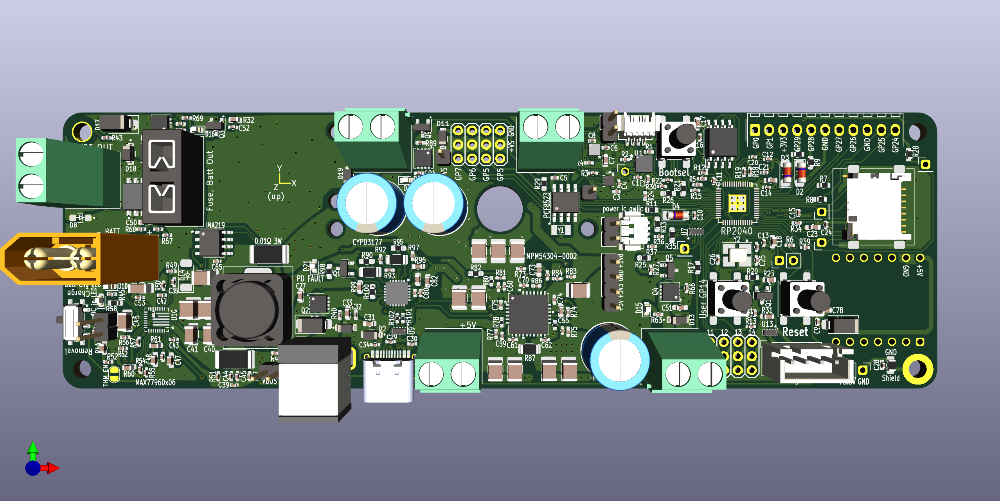
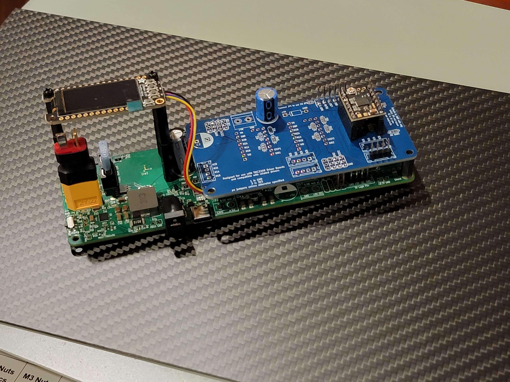

# Sirith Pico
#### Designed by Colin Catlin
License: CERN Open Hardware Licence Version 2 - Strongly Reciprocal

This board was designed to do something standard dev boards cannot do: provide high power (12V, 60W) output with a micro controller and a powerful rechargeable battery. It was designed to power something like a Raspberry Pi Zero, manage an array of servos, contain basic sensor data, log data to an SD card, and send and switch high power off board.

As a number of the ICs on this board are rather expensive, there is also a fairly extensive focus on circuit protections for power sources and GPIO pins, with the aim of reducing the probability of damage to the board.

This board went through countless digital versions, two expert reviews, and no less than 7 production variants. It was made by an amateur, but the design is well tested at this point. Amateur EMI testing was also done and indicated no major sources of unintentional radiation from the board.

Recommendations: switch the Fuse block on the "Batt Out" to PTC resettable fuse(s). The current fuses seem to not always contact the mounts fully.

Highlighted Capabilities:
* USB C Power Delivery Input up to 60W by default
* 2S or 3S Lipo Power and Charging
* Regulated and adjustable 8V or 12V system power
* Regulated 5V, 3.3V, and 1.8V power supply output
* User controllable output for high amperage output directly from battery*
* User controllable outputs for regulated system and 5V power
* Integrated i2c power monitoring circuit
* Integrated SD Card mount
* RP2040 Dual Core Microcontroller with 16 MB of flash memory
* IMU, Magnometer, Barometer
* RTC (if present)
* User-controllable status LEDs
* Pin layouts for connecting 4x 5V servos and 4x high voltage servos
* One 5V level shifted GPIO pin for communicating with devices such as LED light strips
* Footprint for Xiao or QtPy footprint boards for integration of wireless connectivity via UART to RP2040 (add on board not included)
* Integrated protection circuits on most system inputs and outputs
* Qwiic compatible connections of easy integration of other boards
* Assortment of board mounting options for 50 mm * 158.25 mm board

Primary Integrated Circuits (IC):
* RP2040 - primary microcontroller (MCU)
* MAX77960 - battery charger and system voltage regulation
* MPM54304 - 5V, 3.3V, and 1.8V buck regulator
* CYPD3177 - usb pd policy negotiations

Note that by default interrupt pins are not directly connected to the RP2040 MCU in any way.

View documentation of the RP2040 from the Raspberry Pi Foundation for additional details on connecting peripherals and for excellent example tutorials.

MOSFET Power Outputs are connected to unidirectional TVS diodes which should provide inductive flyback protection in addition to transient overvoltage protection. The VBatt FET is additionally connected to a second Schottky diode for increased flyback protection.

For experimentation, it is recommended to begin by using GPIO 7, 28, and 29 as the series resistors and 3V3 Zener Diodes should prevent damage to the MCU from occurring in the event of many common misconfigurations and misconnections. 3V3 Zeners do not exactly maintain 3V3 volts, around 3.1V is often measured with the default GPIO pull up. These zeners may slightly alter the voltage and therefore ADC usage of GPIO28 and GPIO29. Note the 5V TVS diodes breakdown voltage is approximately 8V, these will be less protected than Zener diodes but also less restrictive.

For brevity, pins on the board are labeled GP instead of GPIO or only the number may be provided (ie 11 = GP11 = GPIO11). This should be considered functionally identical.

### System Power:

Primary system power delivery is through the device’s USB-C port. This port provides both data connection to the RP2040 IC as well as device power.  The CYPD3177 device is preconfigured by resistor dividers to negotiate for the highest available voltage up to 20V and 3A. This device can also be configured over i2c from the RP2040 MCU. If the device is only able to negotiate 5V power, the USB default standard power, the LED designated PD FAILURE on the board will be lit.

Power may also be provided through a dc barrel jack (not included, XXX has been used). If both dc barrel and usb c power sources are available, the higher voltage power source will automatically be used. This feature has been shown with limited testing to work for alternating between a 12V rated (~20V open circuit) solar panel and a 5V usb power supply.
Max recommended input is a well-behaved 24V power supply. Voltages above around 25V may  see the TVS over voltage protection beginning to conduct small amounts of power.

There are empty footprints under the DC barrel port for the addition of an LED and a series resistor, both 0803. This can be used to indicate power okay for this DC input and may also be useful to help pull down the open circuit voltage of any connected solar panels, if used.

A small test point header labeled VBUS should show the chosen power supply’s input voltage that will be received by the MAX77960.

### Battery Management

The MAX77960 provides battery charging and system voltage regulation with many inclusive features such as overcurrent protection and thermal shutdown. By default this is configured to use a 3S Lipo (three cell lithium batteries usually labeled 11.1V) with a regulated system max voltage of 12V and system current of 4 amps. By soldering the CNFG JP6 jumper on the bottom of the board, users may switch to a default configuration to 2S (two cell lithium batteries usually labeled 7.4V) at 8V system. The device WILL NOT automatically detect battery type. Connecting the incorrectly configured battery type may result in catastrophic battery failure. To double check the system’s current battery configuration, connect device without battery to DC power and use either the onboard INA219 or a voltmeter to measure Vsys. It should be around 8V in 2S configuration and around 12V in 3S configuration. Please refer to the MAX77960 datasheet for full details.

A sliding switch provides a battery disconnect override. The recommend procedure for battery connection using the XT60 connector is to have the switch in the disconnected position, insert battery, and then slide to charging position. To disconnect, perform in reverse first setting to disconnect then removing the battery. Whenever possible, avoid disconnect of batteries and dc power supply when the system is under significant power load, doing so could cause the board to malfunction. Not this switch does not necessarily trigger immediate battery charging, it merely signals charging enabled to the MAX77960 which proceeds to monitor battery and respond accordingly. While a battery is not needed for the board to function, including one will stabilize maximum power output of the device. In the event there are concerns about this switch accidentally being toggled, it can be removed leaving the device in a default state of battery charge enabled.

A small header labeled THM near the MAX77960 allows the connection of a thermistor. This is recommended if the device will be used in unregulated temperature environments as lithium batteries should not be charged in excessive heat or cold. To use, the THM_EN jumper must first be bridged. The R(resistance at room temp) value of the thermistor must match the value of the resistor R50, which is 10K. As setup, the pull down of ground, 110K on R41 will need to be removed for best accuracy, but should work as is (reading a bit hot). Beware if that resistor is removed a THM to GND thermistor must be present for device to function. In general, use a smaller Beta 10K NTC for a wider temperature cutoff. See MAX77960 datasheet for more info and example thermistor choices.

The INOKB output of the MAX77960 is connected to GPIO16 of the RP2040. This will be pulled low when a valid DC input is detected and can be used as a simple test for the presence of a connected external power source. The MAX77960 is also theoretically capable of reverse powering the USB C port with 5V power when configured to do so over i2c (off by default), but this functionality has not been tested on this board. STAT and INOKB pins from this device have test points on the bottom side of the board.

A pair of XXXX MOSFETs in parallel provide a high-side switchable output from the battery through a mini automative blade style fuse for overcurrent protection. While this has been designed with a target current output of 30 amps, extreme care should be and system monitored for shorts and excessive heating of the board gpiven the high discharge capacity of most lithium ion batteries. Also be aware that the board, which has a default fast charging current of 400 mA, will take much longer to charge the battery than the rate at which it can be discharged. Faster charging rates may be selected by adjusting RX or over i2c.

The system does not include a battery cell balancer. The use of a default 12V max voltage (approximately 80% of capacity) and a slow (for large batteries) fast charge rate of 400 mA should minimize the need for balancing, but cell balancing is still recommended when possible. 

A battery level gauge is also not included. When on battery power, the INA219 can be used to directly monitor the battery voltage and closely approximate battery level. As the default undervoltage protection for the system is lower than ideal, it is highly recommended that users relying on battery power for their systems power down their systems programmatically when a low voltage on the battery is reached to prevent possible battery damage.

Beyond the battery voltage, system regulated voltage (Vsys) from the MAX77960 passes through the INA219 current/voltage/power monitor with a 0.010 ohm resistor which can be read over i2c. Overcurrent protection kicks in after 4 amps but can be configured in the MAX77960 by i2c to be as high as 10 amps. Vsys will follow battery voltage when battery is charging or discharging.

The Vsys has another high side, GPIO-controlled MOSFET switch which can be used to enable or disable power output to an external device. Vsys also has placement for additional bulk capacitance to be installed by the user if needed, to further reduce volatility of the output power.

Vsys has several output connections. Note GPIO5 pin in this section is intentionally duplicated, allowing for synchronous output if needed.

The MPM54304 is powered from Vsys and produces additional regulated power outputs. Note that this IC is the usually hottest on the board, and that care and an additional heatsink is recommended. Note that the device does include automatic thermal shutdown in the event of excessive heat generation but this does not engage until 160°C. Additionally, running the system on a 2S battery setting will reduce heating as the voltage drop will be lower, and this is recommended when a 3S battery is not otherwise needed.

Theoretical max power output o MPM54304 is 6A for 5V, 3A for 3V3 and 3A for 1V8, however this may be limited further by the maximum continuous power dissipation due to thermal limits. To maximize performance, provide a larger heatsink and use a lower input voltage (2S configuration). For further details review the manufacturer’s datasheet for the MPM54304.

It is recommended to have inline resistors or PTC fuses on power lines going off board, especially on the 3V3 line which controls the MCU, to avoid brownouts from external shorts, as the overcurrent protection on the MPM54304 will take down the entire power net in the event of a short. The Power Good pin from this IC is connected to a circular test point on the bottom of the board.

### Board Footprint

The four layer printed circuit board measures 50 mm * 158.25 mm. Mounting holes for M3 screws are present on all four corners. The connections of these are rather irregular. Two are unplated through holes with no copper connection. Two others are plated through holes which should provide more resistance to wear and tear. One, located in the VBat section of the board, is connected to board ground by a 1M Ohm resistor. The other in the opposing corner near the QTPy/Xiao footprint is connected to ground by a capacitor with an adjacent footprint for an additional capacitor, resistor, or ferrite bead if desired, that plated through hole is also connected to USB shield, if present.

### QTPy/Xiao

A footprint designed to be compatible with most Adafruit Industries QTPy or SeeedStudio Xiao layout development board exists on the bottom of this board primarily intended for adding some wireless connectivity, if desired. These devices may be soldered directly or using pin headers, double checking proper alignment. Only four pins of the attached board are connected to the MCU. 5V power provides power to the 5V/USB power of the device through a Schottky diode, resulting in a minor voltage drop (no issues have been observed as result of this voltage drop) and allowing simultaneous connecting of the smaller board with USB. GND is also connected as well as the TX and RX pins of the device enabling communication with pins 24 and 25 of the RP2040 (see Table 1).

### Programming the Board

Programming the board should be identical in most ways to programming a Raspberry Pi Pico. BOOTSEL is held down while the device is plugged into the USB port of a host device to allow installation of UF2 boot files on initial setup. All UF2 files compatible with Raspberry Pi Picos should be compatible with this device, although note that pin aliases in the device software, such as “LED” pin will not align with a board LED.

### i2c addresses
* 0x08 = CYPD3177
* 0x23 =TPS probably
* 0x3C = display, if connected
* 0x40 = INA219
* 0x68 = MPM
* 0x68 = RTC
* 0x69 = MAX probably

* 0x10 = BMM150
* 0x68 = RTC
* 0x68/Ox69 = BMI270
* Ox77/Ox76 = BMP390

### Table 1: GPIO Functions
| **Pin/Output**  | **Functions**                                                                                                               | **Onboard Protections/Connections**                                                                                          |
| --------------- | --------------------------------------------------------------------------------------------------------------------------- | ---------------------------------------------------------------------------------------------------------------------------- |
| RP2040 GPIO 0   | General purpose, labeled TX                                                                                                 | 27 Ohm series resistor                                                                                                       |
| RP2040 GPIO 1   | General purpose, labeled RX                                                                                                 | 27 Ohm series resistor                                                                                                       |
| RP2040 GPIO 2   | I2C 1 SDA for Sensors, ‘sense qwiic’                                                                                        | 27 Ohm series resistor, 4K7 Ohm pull-up to 3V3                                                                               |
| RP2040 GPIO 3   | I2C 1 SCL for Sensors, ‘sense qwiic’                                                                                        | 27 Ohm series resistor, 4K7 Ohm pull-up to 3V3                                                                               |
| RP2040 GPIO 4   | Enables Vsys MOSFET and LED when pulled high,                                                                               | 330 Ohm series resistor, 1M Ohm pull down to GND                                                                             |
| RP2040 GPIO 5   | Vsys header, duplicated with two positions on output header                                                                 |                                                                                                                              |
| RP2040 GPIO 6   | Vsys header, single header                                                                                                  |                                                                                                                              |
| RP2040 GPIO 7   | Vsys header, single header                                                                                                  | 330 Ohm series resistor, 3V3 Zener to GND                                                                                    |
| RP2040 GPIO 8   | I2C0 SDA, ‘power ic qwiic’, connected to board power ICs                                                                    | 27 Ohm series resistor, 4K7 Ohm pull-up to 3V3, 5V TVS diode                                                                 |
| RP2040 GPIO 9   | I2C0 SCL, ‘power ic qwiic’, connected to board power ICs                                                                    | 27 Ohm series resistor, 4K7 Ohm pull-up to 3V3, 5V TVS diode                                                                 |
| RP2040 GPIO 10  | Enables 5V MOSFET/+5VF when pulled high, also with additional header near SD card enclosure, also can be used as status LED | 330 Ohm series resistor (between header and MOSFET, not between header and MCU), 1M Ohm pull down to GND, 5V TVS diode |
| RP2040 GPIO 11  | Header near system 5V outputs                                                                                               | 330 Ohm series resistor and 5V TVS for surge protection                                                                      |
| RP2040 GPIO 12  | Header near system 5V outputs                                                                                               |                                                                                                                              |
| RP2040 GPIO 13  | Header near system 5V outputs                                                                                               |                                                                                                                              |
| RP2040 GPIO 14  | Header near system 5V outputs                                                                                               | Connected to button, can be programmed as an input                                                                           |
| RP2040 GPIO 15  | 5V Logic Level GPIO, level shifted by BSS138 with 110K Ohm pull-up to 5V                                                    | 330 Ohm series resistor                                                                                                      |
| RP2040 GPIO 16  | INOKB to MAX77960 pulls low when DC power present, floating when disconnected                                            |                                                                                                                              |
| RP2040 GPIO 17  | Enables VBatt MOSFET when pulled high                                                                                       | 330 Ohm series resistor, 1M Ohm pull down to GND                                                                             |
| RP2040 GPIO 18  | CLK pin of SD Card                                                                                                          |                                                                                                                              |
| RP2040 GPIO 19  | CMD pin of SD Card                                                                                                          |                                                                                                                              |
| RP2040 GPIO 20  | DAT0 of SD Card                                                                                                             | 10K pull-up to 3V3                                                                                                           |
| RP2040 GPIO 21  | DAT1 of SD Card, additional header near SD card when unused                                                                 |                                                                                                                              |
| RP2040 GPIO 22  | DAT2 of SD Card, additional header near SD card when unused                                                                 |                                                                                                                              |
| RP2040 GPIO 23  | DAT3/CD of SD Card                                                                                                          |                                                                                                                              |
| RP2040 GPIO 24  | Two connections, to header and to RX of QTPy/Xiao footprint, so is TX of MCU when used                                      | 330 Ohm series resistor                                                                                                      |
| RP2040 GPIO 25  | Two connections,to  header and to TX of QTPy/Xiao footprint, so is RX of MCU when used                                      | 330 Ohm series resistor                                                                                                      |
| RP2040 GPIO 26  | Header                                                                                                                      |                                                                                                                              |
| RP2040 GPIO 27  | Header                                                                                                                      |                                                                                                                              |
| RP2040 GPIO 28  | Header                                                                                                                      | 330 Ohm series resistor, 3V3 Zener to GND                                                                                    |
| RP2040 GPIO 29  | Header                                                                                                                      | 330 Ohm series resistor, 3V3 Zener to GND                                                                                    |
| SWDIO and SWCLK | Debugging connections for RP2040                                                                                            |                                                                                                                              |
| INT             | Connection to interrupt pin from device IMU                                                                                 |                                                                                                                              |
| INT MAG         | Connection to interrupt pin from device manometer                                                                           |                                                                                                                              |
| INT/CLKOUT      | Connection to interrupt/clkout pin from device RTC, if present                                                              |                                                                                                                              |